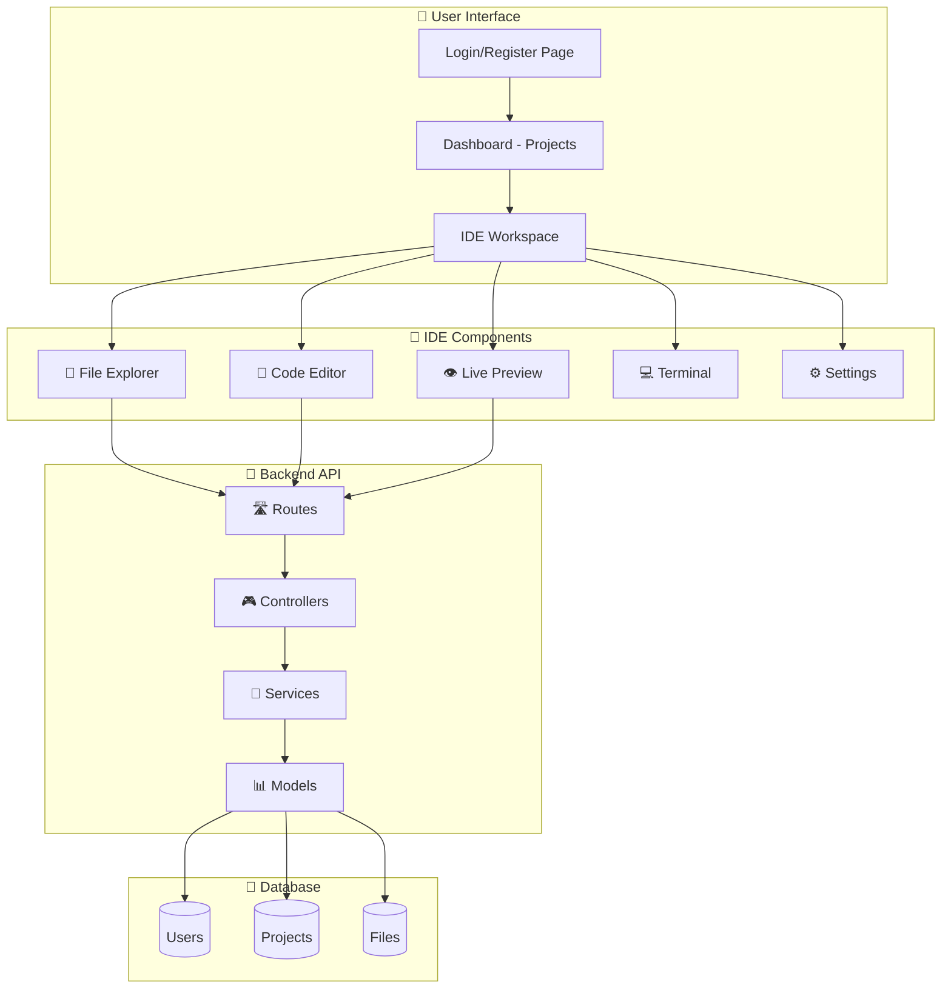
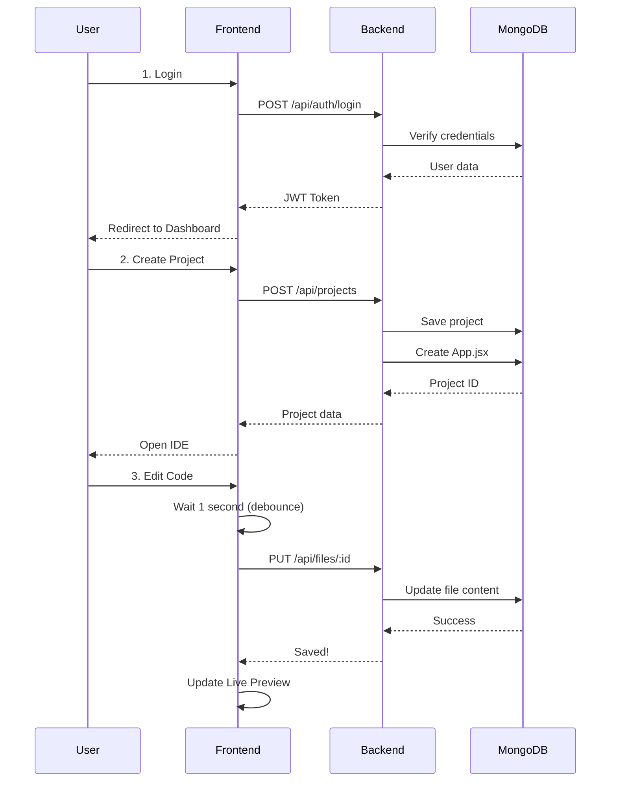
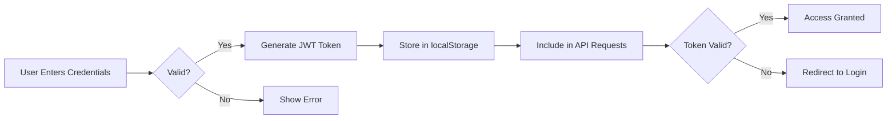
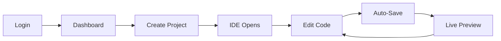

# 🚀 CipherStudio - How It Works (Simple Guide)

## 📖 What is CipherStudio?

**CipherStudio** is a browser-based IDE for React development. Think of it as:
- VS Code + CodeSandbox combined
- Write React code in your browser
- See live preview instantly
- Save projects to the cloud
- Access from anywhere!

---

## 🔄 System Architecture

### High-Level Overview



---

### Data Flow (How Everything Connects)



---

### Authentication Flow



---

## 📁 Complete Folder Structure

### What Each File Does (Simple Explanation)

```
CipherSchools_Project/
│
├── 📂 backend/                          # Server-side (Node.js + Express)
│   │
│   ├── 📂 config/
│   │   └── database.js                  # 🔌 Connects to MongoDB
│   │
│   ├── 📂 controllers/                  # 🎮 Handle requests
│   │   ├── authController.js            # Login, Register, Get Profile
│   │   ├── projectController.js         # Create, Read, Update, Delete projects
│   │   ├── fileController.js            # Create, Read, Update, Delete files
│   │   └── userController.js            # User profile management
│   │
│   ├── 📂 middleware/                   # 🛡️ Request filters
│   │   ├── auth.js                      # Check if user is logged in (JWT)
│   │   ├── cors.js                      # Allow frontend to call backend
│   │   ├── errorHandler.js              # Catch and format errors
│   │   └── validation.js                # Validate user input
│   │
│   ├── 📂 models/                       # 📊 Database schemas
│   │   ├── User.js                      # User data: email, password, preferences
│   │   ├── Project.js                   # Project data: name, framework, settings
│   │   └── File.js                      # File data: name, content, type
│   │
│   ├── 📂 routes/                       # 🛣️ API endpoints
│   │   ├── auth.js                      # /api/auth/login, /register
│   │   ├── projects.js                  # /api/projects (CRUD)
│   │   ├── files.js                     # /api/files (CRUD)
│   │   └── users.js                     # /api/users/profile
│   │
│   ├── 📂 services/                     # 🔨 Business logic
│   │   ├── authService.js               # Handle login/register logic
│   │   ├── projectService.js            # Handle project operations
│   │   └── fileService.js               # Handle file operations
│   │
│   ├── 📂 utils/                        # 🛠️ Helper functions
│   │   ├── frameworkTemplates.js        # React starter code (App.jsx)
│   │   ├── validators.js                # Input validation rules
│   │   └── helpers.js                   # Utility functions
│   │
│   ├── .env                             # 🔐 Secret keys (NOT in git!)
│   ├── .env.example                     # Template for .env
│   ├── .gitignore                       # Files to ignore in git
│   ├── package.json                     # Dependencies list
│   └── server.js                        # 🚀 START HERE - Boots the server
│
└── 📂 frontend/                         # Client-side (React)
    │
    ├── 📂 public/
    │   ├── index.html                   # HTML template
    │   └── favicon.ico                  # Website icon
    │
    └── 📂 src/
        │
        ├── 📂 components/               # React components
        │   │
        │   ├── 📂 Auth/                 # 🔐 Authentication
        │   │   ├── Login.jsx            # Login form
        │   │   ├── Register.jsx         # Registration form
        │   │   └── ProtectedRoute.jsx   # Protect routes (need login)
        │   │
        │   ├── 📂 IDE/                  # 💻 IDE Components
        │   │   ├── CodeEditor.jsx       # Monaco editor (like VS Code)
        │   │   ├── FileExplorer.jsx     # File tree (create, delete, rename)
        │   │   ├── LivePreview.jsx      # Show React app preview
        │   │   ├── Terminal.jsx         # Terminal UI (basic commands)
        │   │   ├── StatusBar.jsx        # Bottom bar (file name, status)
        │   │   ├── SettingsPanel.jsx    # Settings (theme, auto-save)
        │   │   └── IDE.css              # IDE styles
        │   │
        │   ├── 📂 Layout/               # 🎨 Layout components
        │   │   ├── Header.jsx           # Top navigation bar
        │   │   ├── Sidebar.jsx          # Left sidebar (Explorer, Terminal)
        │   │   └── Layout.css           # Layout styles
        │   │
        │   ├── 📂 Project/              # 📦 Project components
        │   │   ├── ProjectList.jsx      # Grid of all projects
        │   │   ├── ProjectCard.jsx      # Single project card
        │   │   ├── ProjectModal.jsx     # Create/Edit project dialog
        │   │   └── Project.css          # Project styles
        │   │
        │   ├── 📂 UI/                   # 🎨 Reusable UI components
        │   │   ├── Button.jsx           # Custom button
        │   │   ├── Input.jsx            # Custom input field
        │   │   ├── Modal.jsx            # Modal dialog
        │   │   ├── Loader.jsx           # Loading spinner
        │   │   └── UI.css               # UI component styles
        │   │
        │   └── 📂 ErrorBoundary/        # 🛡️ Error handling
        │       └── ErrorBoundary.jsx    # Catch React errors gracefully
        │
        ├── 📂 hooks/                    # 🎣 Custom React hooks
        │   ├── useAuth.js               # Authentication state & functions
        │   ├── useProject.js            # Project operations (create, delete)
        │   ├── useFileSystem.js         # File operations (create, update)
        │   └── useLocalStorage.js       # localStorage helper
        │
        ├── 📂 pages/                    # 📄 Page components
        │   ├── Dashboard.jsx            # Projects dashboard page
        │   ├── IDEWorkspace.jsx         # Main IDE page
        │   └── Pages.css                # Page styles
        │
        ├── 📂 services/                 # 🌐 API communication
        │   ├── api.js                   # Axios setup (base URL, interceptors)
        │   ├── authService.js           # Auth API calls (login, register)
        │   ├── projectService.js        # Project API calls
        │   └── fileService.js           # File API calls
        │
        ├── 📂 styles/                   # 🎨 Global styles
        │   ├── components.css           # Component styles
        │   └── variables.css            # CSS variables (colors, fonts)
        │
        ├── 📂 utils/                    # 🛠️ Utility functions
        │   ├── constants.js             # App constants (framework options)
        │   ├── fileUtils.js             # File helper functions
        │   └── helpers.js               # General helper functions
        │
        ├── App.jsx                      # 🎯 Root component (routes)
        ├── index.js                     # 🚀 START HERE - Renders React app
        ├── .gitignore                   # Files to ignore in git
        └── package.json                 # Dependencies list
```

---

## 🎯 File Responsibilities (Quick Reference)

### Backend Files

| File | What It Does | Example |
|------|--------------|---------|
| `server.js` | Starts Express server | `app.listen(5000)` |
| `database.js` | Connects to MongoDB | `mongoose.connect(URI)` |
| `authController.js` | Handles login/register | `POST /api/auth/login` |
| `projectController.js` | Manages projects | `GET /api/projects` |
| `fileController.js` | Manages files | `PUT /api/files/:id` |
| `User.js` | User database schema | `{ email, password }` |
| `Project.js` | Project database schema | `{ name, framework }` |
| `File.js` | File database schema | `{ name, content }` |
| `auth.js` (middleware) | Verifies JWT token | Protects routes |
| `frameworkTemplates.js` | React starter code | Template for new projects |

### Frontend Files

| File | What It Does | Example |
|------|--------------|---------|
| `index.js` | Renders React app | `root.render(<App />)` |
| `App.jsx` | Root component + routes | `<Route path="/" />` |
| `Login.jsx` | Login form | Email + Password |
| `Dashboard.jsx` | Shows all projects | Grid of project cards |
| `IDEWorkspace.jsx` | Main IDE page | Editor + Preview + Sidebar |
| `CodeEditor.jsx` | Monaco editor | Syntax highlighting |
| `FileExplorer.jsx` | File tree | Create, rename, delete |
| `LivePreview.jsx` | React preview | Renders user's code |
| `Terminal.jsx` | Terminal UI | Basic commands |
| `useAuth.js` | Auth state & functions | `login()`, `logout()` |
| `useProject.js` | Project operations | `createProject()` |
| `useFileSystem.js` | File operations | `updateFile()` |
| `api.js` | Axios setup | Base URL + interceptors |

---

## 🔄 How It All Works (Step by Step)

### 1️⃣ User Registration/Login
```
User fills form → Frontend sends to /api/auth/login
→ Backend checks MongoDB → Generates JWT token
→ Frontend stores token → User logged in!
```

### 2️⃣ Creating a Project
```
User clicks "Create Project" → Fills form (name, framework)
→ Frontend sends to /api/projects
→ Backend creates project in MongoDB
→ Backend creates App.jsx with template code
→ Frontend opens IDE with new project
```

### 3️⃣ Editing Code
```
User types in Monaco Editor → Frontend waits 1 second (debounce)
→ Frontend sends to /api/files/:id
→ Backend saves to MongoDB
→ Live Preview updates automatically
```

### 4️⃣ Live Preview
```
User's React code → Babel transpiles JSX
→ React loads from CDN → Renders in iframe
→ User sees live result!
```

---

## 🛠️ Tech Stack (Simple)

### Frontend
- **React** - UI library
- **React Router** - Page navigation
- **Monaco Editor** - Code editor (like VS Code)
- **Axios** - API calls

### Backend
- **Node.js** - JavaScript runtime
- **Express** - Web framework
- **MongoDB** - Database
- **JWT** - Authentication tokens
- **bcrypt** - Password hashing

### Security
- **Helmet** - Security headers
- **CORS** - Cross-origin protection
- **Rate Limiting** - Prevent spam
- **Joi** - Input validation

---

## 🚀 Quick Start

```bash
# 1. Clone repository
git clone <your-repo-url>
cd CipherSchools_Project

# 2. Setup Backend
cd backend
npm install
cp .env.example .env
# Edit .env with your MongoDB URI
npm run dev

# 3. Setup Frontend (new terminal)
cd ../frontend
npm install
npm start

# 4. Open browser
# Frontend: http://localhost:3000
# Backend: http://localhost:5000
```

---

## 📊 API Endpoints (Quick Reference)

### Authentication
```
POST /api/auth/register  - Create account
POST /api/auth/login     - Login
GET  /api/auth/profile   - Get user info (protected)
```

### Projects
```
GET    /api/projects     - Get all projects (protected)
POST   /api/projects     - Create project (protected)
GET    /api/projects/:id - Get one project (protected)
PUT    /api/projects/:id - Update project (protected)
DELETE /api/projects/:id - Delete project (protected)
```

### Files
```
GET    /api/files/project/:projectId - Get all files (protected)
POST   /api/files                    - Create file (protected)
GET    /api/files/:id                - Get one file (protected)
PUT    /api/files/:id                - Update file (protected)
DELETE /api/files/:id                - Delete file (protected)
```

---

## 🎯 Key Features

- ✅ **Monaco Editor** - Professional code editor
- ✅ **Live Preview** - See changes instantly
- ✅ **Auto-Save** - Code saves automatically (1 sec)
- ✅ **File Management** - Create, edit, delete files
- ✅ **Cloud Storage** - All code saved to MongoDB
- ✅ **Authentication** - Secure login with JWT
- ✅ **React Templates** - Start with working code
- ✅ **Responsive** - Works on all devices

---

## 💡 Simple Workflow



---

## 🎉 That's It!

**CipherStudio** = Browser IDE for React
- Write code → Auto-save → Live preview
- Access from anywhere
- No installation needed!

**Happy Coding!** 🚀⚛️
